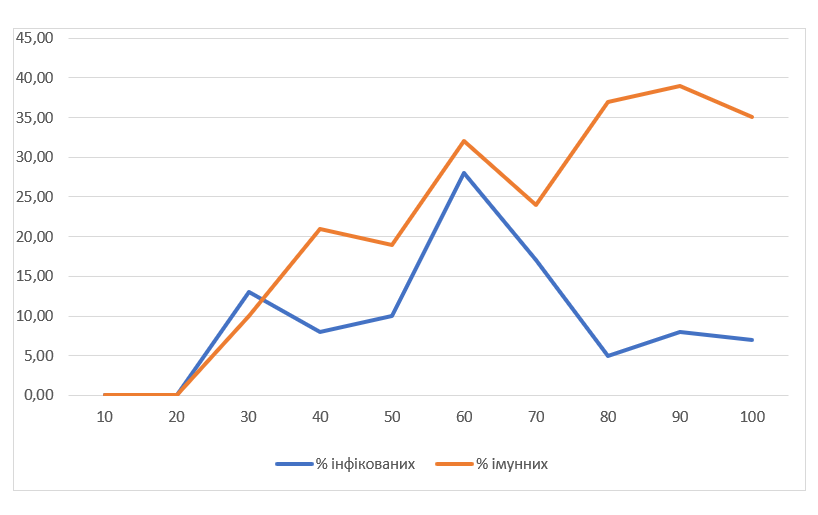
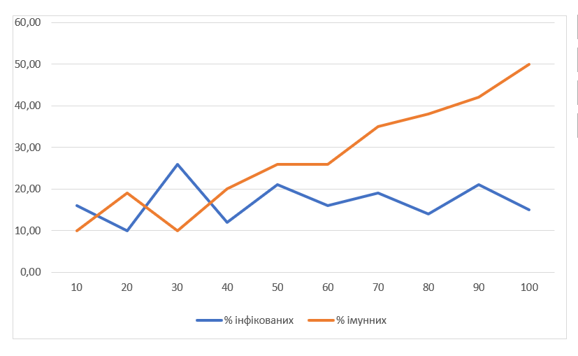
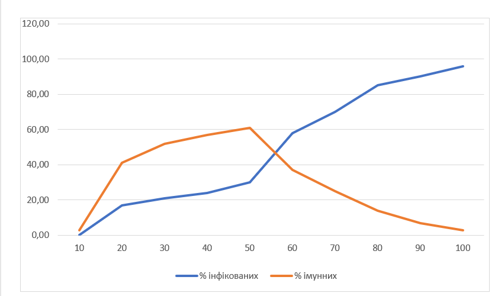

## Комп'ютерні системи імітаційного моделювання
## СПм-23-3, **Рагулін Олександр Євгенович**
### Лабораторна робота №**1**. Опис імітаційних моделей та проведення обчислювальних експериментів

 

### Варіант 3, Модель поширення захворювання у людській популяції.:
[Virus](https://www.netlogoweb.org/launch#https://www.netlogoweb.org/assets/modelslib/Sample%20Models/Biology/Virus.nlogo)

 

### Вербальний опис моделі:
Ця модель імітує поширення вірусу серед людської популяції з початковою кількістю 150 осіб, включаючи 10 заражених. Люди можуть загинути від інфекції або старості. Якщо загальна чисельність населення становить менше 300 осіб, здорові особи можуть народжувати здорове, але сприйнятливе до інфекції потомство. Люди переміщуються випадковим чином і можуть перебувати в одному з трьох станів: здорові та сприйнятливі до інфекції (зелений); хворі та інфекційні (червоний); здорові та імунні (сірий).

### Керуючі параметри:
- **number-people** встановлює кількість людей у симуляції.
- **infectiousness** визначає ймовірність передачі вірусу, коли інфікована та сприйнятлива особа опиняються на одній ділянці.
- **chance-recover** це ймовірність, що інфекція завершиться одужанням або імунітетом. Наприклад, коли цей повзунок встановлено на нуль, інфекція є завжди смертельною.
- **duration** задає кількість тижнів до смерті або одужання інфікованої особи.

### Внутрішні параметри:
- **sick?** якщо true, означає, що людина заразна.
- **remaining-immunity** показує, скільки тижнів імунітету залишилося у людини.
- **sick-time** відображає, як довго людина була інфікованою.
- **lifespan** параметр, що задає тривалість життя людей у моделі. Тут lifespan становить 2600 тижнів, що відповідає приблизно 50 рокам.
- **age** визначає вік людини у тижнях.
- **chance-reproduce** вказує на ймовірність народження потомства.
- **immunity-duration** визначає, скільки тижнів триває імунітет.

### Показники роботи системи:
- **%infected** показує, який відсоток населення є інфікованим.
- **%immune** вказує, який відсоток населення має імунітет.
- **years** кількість років, що минула.
- **Populations** чисельність інфікованих, здорових, імунних людей і загальна чисельність населення.

### Примітки:
- Зазвичай спочатку відбувається вибух інфекції, оскільки на початковому етапі населення не має імунітету. Це схоже на перший «спалах» вірусної інфекції в популяції, що часто призводить до значних втрат. Проте згодом вірус стає менш поширеним, оскільки динаміка популяції змінюється.
- Віруси, що надто успішно поширюються (інфікуючи майже всіх), можуть не вижити в довгостроковій перспективі, оскільки всі інфіковані або помирають, або стають імунними, що обмежує потенційне число носіїв.

### Недоліки моделі:
- Немає можливості вказати початкову кількість інфікованих.
- Вік не впливає на ймовірність інфікування та результат захворювання.
- Здорові люди не уникають інфікованих.
- Немає можливості регулювання тривалості імунітету та ймовірності повторного зараження.

 

## Обчислювальні експерименти
### 1. Вплив заразності вірусу на кількість інфікованих
Досліджується вплив заразності вірусу на кількість інфікованих та імунних людей протягом 100 тактів. 
Експерименти проводяться при значеннях заразності від 10 до 100 з кроком 10, всього 10 симуляцій.  
Інші керуючі параметри залишаються за замовчуванням:
- **number-people**: 150
- **chance-recover**: 70%
- **duration**: 18

<table>
<thead>
<tr><th>Заразність</th><th>% інфікованих</th><th>% імунних</th></tr>
</thead>
<tbody>
<tr><td>10</td><td>0</td><td>0</td></tr>
<tr><td>20</td><td>1</td><td>0</td></tr>
<tr><td>30</td><td>14</td><td>9</td></tr>
<tr><td>40</td><td>9</td><td>22</td></tr>
<tr><td>50</td><td>12</td><td>20</td></tr>
<tr><td>60</td><td>27</td><td>34</td></tr>
<tr><td>70</td><td>18</td><td>23</td></tr>
<tr><td>80</td><td>6</td><td>36</td></tr>
<tr><td>90</td><td>9</td><td>38</td></tr>
<tr><td>100</td><td>6</td><td>34</td></tr>
</tbody>
</table>

Заразність вірусу значно впливає на перебіг епідемії в популяції. На графіку видно, що при низькій заразності (10-20) кількість інфікованих та імунних осіб залишається низькою, що ускладнює виживання вірусу в популяції. Зі збільшенням заразності (30-40) зростає і кількість інфікованих, і кількість імунних. При високій заразності (60 і вище) спостерігається значний ріст числа імунних осіб та спад числа інфікованих, оскільки більша частина популяції швидко заражається та отримує імунітет.

### 2. Вплив шансу одужати на кількість інфікованих
Досліджується залежність кількості інфікованих та імунних людей від шансу одужати протягом 100 тактів.
Експерименти проводяться при значеннях шансу одужати від 10 до 100 з кроком 10, всього 10 симуляцій.  
Інші параметри керування мають значення за замовчуванням:
- **number-people**: 150
- **infectiousness**: 60%
- **duration**: 18

<table>
<thead>
<tr><th>Шанс одужати</th><th>% інфікованих</th><th>% імунних</th></tr>
</thead>
<tbody>
<tr><td>10</td><td>15</td><td>12</td></tr>
<tr><td>20</td><td>11</td><td>18</td></tr>
<tr><td>30</td><td>24</td><td>12</td></tr>
<tr><td>40</td><td>13</td><td>21</td></tr>
<tr><td>50</td><td>20</td><td>28</td></tr>
<tr><td>60</td><td>17</td><td>27</td></tr>
<tr><td>70</td><td>21</td><td>34</td></tr>
<tr><td>80</td><td>13</td><td>37</td></tr>
<tr><td>90</td><td>20</td><td>41</td></tr>
<tr><td>100</td><td>16</td><td>48</td></tr>
</tbody>
</table>

На графіку видно, що при збільшенні шансу на одужання збільшується відсоток імунних у популяції. Це можна пояснити тим, що більше людей виживає після хвороби, отримуючи імунітет. Варто зауважити, що високий рівень смертності від хвороби може негативно впливати на популяцію та вірус, оскільки вірус ризикує швидко знищити всіх людей, що не сприяє його довготривалому виживанню.

### 3. Вплив тривалості хвороби на кількість інфікованих
Досліджується вплив тривалості хвороби на кількість інфікованих та імунних людей протягом 100 тактів.
Експерименти проводяться при значеннях тривалості хвороби від 10 до 100 з кроком 10, всього 10 симуляцій.  
Інші параметри керування залишаються за замовчуванням:
- **number-people**: 150
- **infectiousness**: 60%
- **chance-recover**: 70%

<table>
<thead>
<tr><th>Тривалість хвороби</th><th>% інфікованих</th><th>% імунних</th></tr>
</thead>
<tbody>
<tr><td>10</td><td>2</td><td>3</td></tr>
<tr><td>20</td><td>16</td><td>42</td></tr>
<tr><td>30</td><td>22</td><td>53</td></tr>
<tr><td>40</td><td>23</td><td>58</td></tr>
<tr><td>50</td><td>32</td><td>60</td></tr>
<tr><td>60</td><td>59</td><td>35</td></tr>
<tr><td>70</td><td>69</td><td>27</td></tr>
<tr><td>80</td><td>83</td><td>16</td></tr>
<tr><td>90</td><td>89</td><td>8</td></tr>
<tr><td>100</td><td>95</td><td>5</td></tr>
</tbody>
</table>

З графіку видно, що тривалість хвороби прямо пропорційно впливає на кількість інфікованих осіб. Це пов’язано з тим, що при тривалій хворобі вірус має більше часу для поширення в популяції. При короткій тривалості (10 і менше) хвороба не має шансів на поширення, оскільки не встигає заразити значну частину населення.