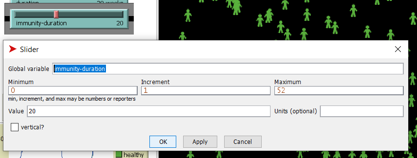
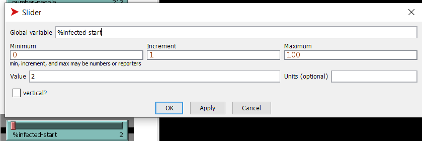
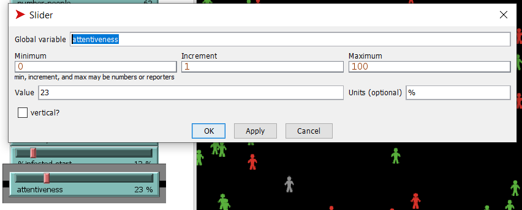
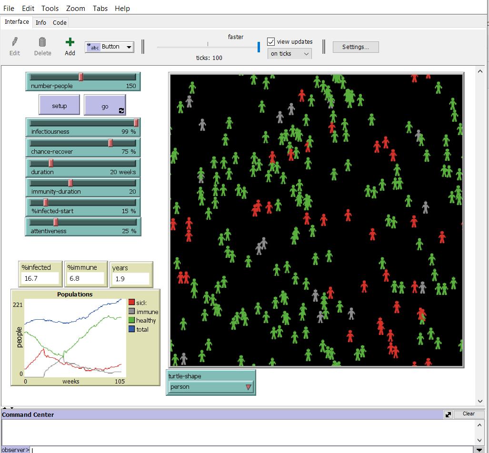
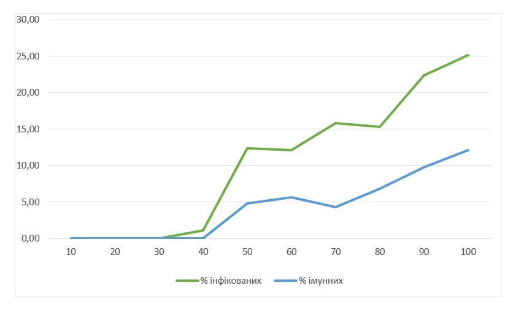

## Комп'ютерні системи імітаційного моделювання
## СПм-23-3, **Рагулін Олександр Євгенович**
### Лабораторна робота №**2**. Редагування імітаційних моделей у середовищі NetLogo

 

### Варіант 3, модель у середовищі NetLogo:
[Virus](https://www.netlogoweb.org/launch#https://www.netlogoweb.org/assets/modelslib/Sample%20Models/Biology/Virus.nlogo)

 

### Внесені зміни у вихідну логіку моделі, за варіантом:

**Вплив віку на ризик інфікування та результат хвороби додано до моделі.**

Процедура **infect** була змінена: додано змінну age-influence, що враховує вік під час зараження. Якщо вік людини перевищує 40 років або вона молодша за 10 років, ймовірність зараження збільшується на 10%.
<pre>
to infect ;; turtle procedure
  ask other turtles-here with [ not sick? and not immune? ]
  [
      let age-influence 0
      ifelse age > 40 * 52 or age < 10 * 52 [set age-influence 10][set age-influence 0]
      if (random-float 100) < (infectiousness + age-influence)
      [ get-sick ] 
  ]
end
</pre>

Процедура **recover-or-die** також була змінена для врахування віку під час визначення результату хвороби. Додана змінна age-influence зменшує шанс на одужання на 10%, якщо вік людини більше 40 років або менше 10 років.
<pre>
to recover-or-die ;; turtle procedure
  if sick-time > duration                        ;; If the turtle has survived past the virus' duration, then
  [ 
      let age-influence 0
      ifelse age > 40 * 52 or age < 10 * 52 [set age-influence 10][set age-influence 0]
      ifelse random-float 100 < chance-recover - age-influence  ;; either recover or die
      [ become-immune ]
      [ die ] 
  ]
end
</pre>

**Вплив відсотка інфікованих на появу нових агентів також додано.**

Процедура update-global-variables була оновлена: змінна chance-reproduce тепер залежить від кількості інфікованих людей у популяції. При збільшенні відсотка інфікованих шанси на народження нових агентів зменшуються. Раніше ця ймовірність становила фіксовані 1%.
<pre>
to update-global-variables
  if count turtles > 0
    [ set %infected (count turtles with [ sick? ] / count turtles) * 100
      set %immune (count turtles with [ immune? ] / count turtles) * 100 
      set chance-reproduce 1 - %infected / 100 
  ]
end
</pre>

**Можливість налаштування тривалості імунітету також була додана.**

Глобальна змінна:
<pre>
immunity-duration
</pre>

була видалена. Тепер слайдер відповідає за ініціалізацію цієї змінної.
<pre>
  to setup-constants
    set lifespan 50 * 52      ;; 50 times 52 weeks = 50 years = 2600 weeks old
    set carrying-capacity 300
    set chance-reproduce 1
end
</pre>

Слайдер для налаштування тривалості імунітету:

### Внесені зміни у вихідну логіку моделі, на власний розсуд:

**Налаштована кількість початково інфікованих осіб.**

Процедура *setup-turtles* була оновлена для налаштування початкової кількості хворих. Тепер глобальна змінна *%infected-start*, що налаштовується через відповідний слайдер, задає відсоток інфікованих від загального числа людей у моделі, тоді як раніше 10 осіб завжди обиралися як інфіковані.
<pre>
  to setup-turtles
  create-turtles number-people
    [ setxy random-xcor random-ycor
      set age random lifespan
      set sick-time 0
      set remaining-immunity 0
      set size 1.5  ;; easier to see
      get-healthy ]
  ask n-of (count turtles / 100 * %infected-start) turtles
    [ get-sick ]
end
</pre>

Слайдер, що налаштовує початкову кількість інфікованих:

**Рух людей у симуляції покращено.**

Тепер люди, за певної ймовірності, уникатимуть хворих, рухаючись у протилежному напрямку. Якщо поблизу немає хворих, вони продовжуватимуть рухатися випадково, як і раніше. Зміни внесені до процедури *move*.
<pre>
  to move ;; turtle procedure
  
  let nearby-turtles turtles in-radius 4
  let red-turtles (nearby-turtles with [color = red])
  
  ifelse any? red-turtles and not sick? and random-float 100 < attentiveness [
    face one-of red-turtles
    rt 180  ; Turn around
    fd 1  
  ]  [
    ; If there are no red turtles nearby, move randomly
    rt random 100
    lt random 100
    fd 1
  ]
end
</pre>

Слайдер, який регулює ймовірність уникання хворих:

Скріншот моделі під час симуляції:

Фінальний код моделі та її інтерфейс можна знайти за [посиланням](Virus_better.nlogo). 
 

## Обчислювальні експерименти
### 1. Вплив заразності вірусу на кількість інфікованих
Досліджено вплив рівня заразності вірусу на кількість інфікованих та імунних осіб за 100 тактів. Проведено 10 симуляцій зі значеннями заразності від 10 до 100 із кроком 10.  
Інші параметри керування залишаються стандартними:
- **number-people**: 150
- **chance-recover**: 75%
- **duration**: 20
- **immunity-duration**: 22
- **%infected-start**: 12%
- **attentiveness**: 30%

<table>
<thead>
<tr><th>Заразність</th><th>% інфікованих</th><th>% імунних</th></tr>
</thead>
<tbody>
<tr><td>10</td><td>0</td><td>0</td></tr>
<tr><td>20</td><td>0</td><td>0</td></tr>
<tr><td>30</td><td>1</td><td>1</td></tr>
<tr><td>40</td><td>2,1</td><td>0,5</td></tr>
<tr><td>50</td><td>10,3</td><td>5,2</td></tr>
<tr><td>60</td><td>11,7</td><td>6,3</td></tr>
<tr><td>70</td><td>14,6</td><td>4,9</td></tr>
<tr><td>80</td><td>16,1</td><td>7,4</td></tr>
<tr><td>90</td><td>20,8</td><td>9,2</td></tr>
<tr><td>100</td><td>24,5</td><td>11,3</td></tr>
</tbody>
</table>

Цей експеримент аналогічний першому експерименту з лабораторної роботи 1, але був доданий параметр "attentiveness" або уважність, що позначає ймовірність уникнення хворих людей та підтримки відстані від них. З рівнем уважності 30% спостерігається значне зниження кількості інфікованих на всіх рівнях заразності порівняно з початковим експериментом, що демонструє ефективність уникнення хворих у зниженні поширення вірусу в популяції.
