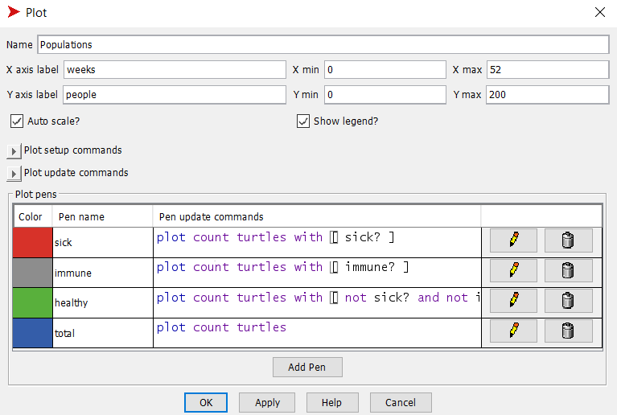
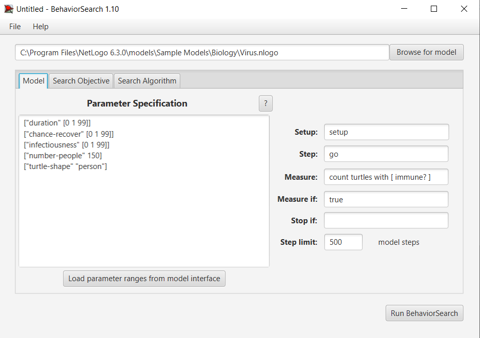
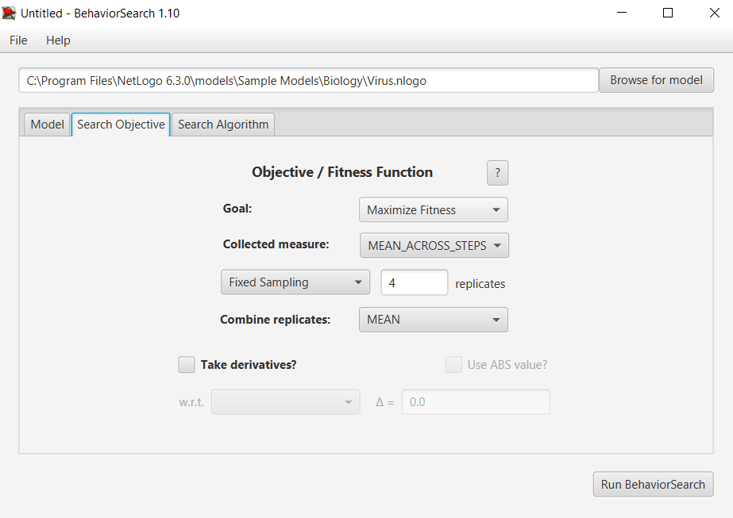
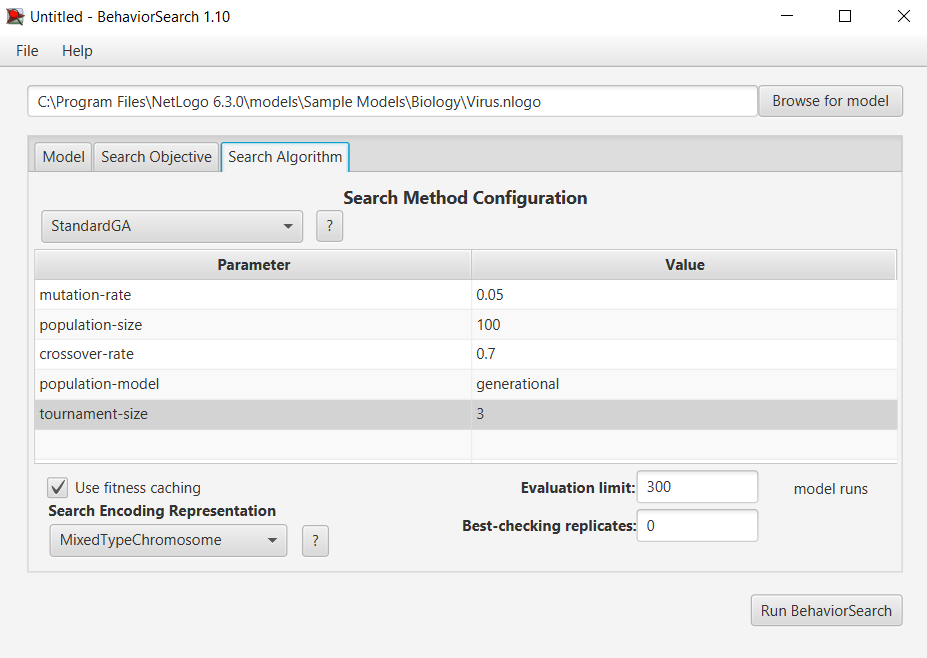
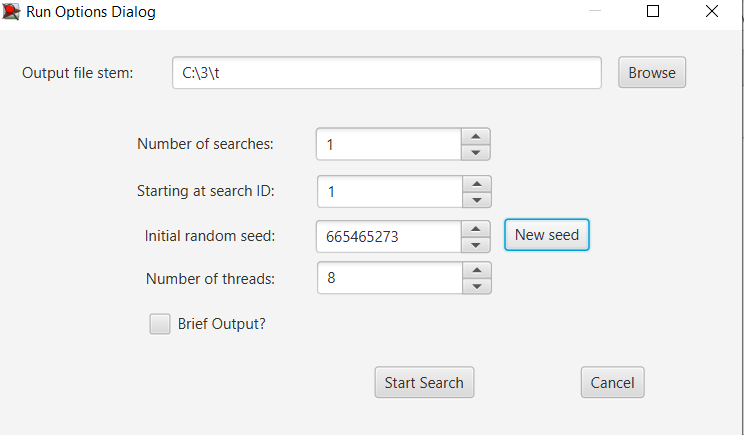
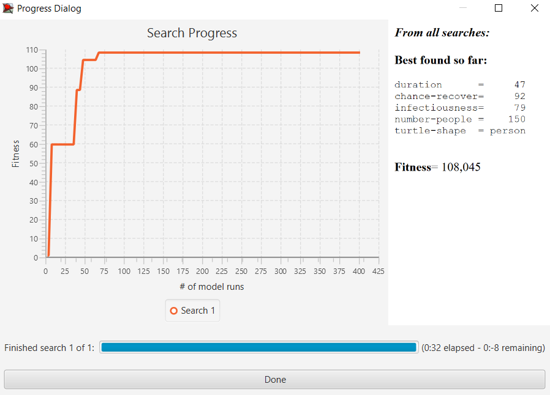
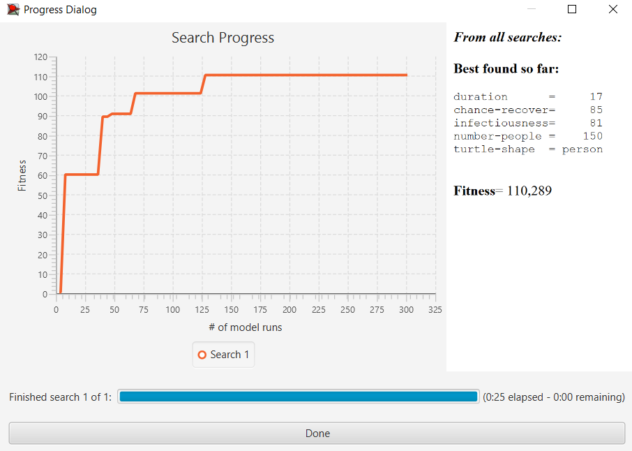

## Комп'ютерні системи імітаційного моделювання
## СПм-23-3, **Рагулін Олександр Євгенович**
### Лабораторна робота №**3**. Використання засобів обчислювального інтелекту для оптимізації імітаційних моделей

 

### Варіант 3, модель у середовищі NetLogo:
[Virus](https://www.netlogoweb.org/launch#https://www.netlogoweb.org/assets/modelslib/Sample%20Models/Biology/Virus.nlogo)

 

### Налаштування середовища BehaviorSearch:

**Параметри моделі** (вкладка Model):  
<pre>
["duration" [0 1 99]]
["chance-recover" [0 1 99]]
["infectiousness" [0 1 99]]
["number-people" 150]
["turtle-shape" "person"]
</pre>

Для фітнес-функції обрано **кількість людей з імунітетом**. Формула для її розрахунку взята з налаштувань графіка **Populations** у середовищі NetLogo для аналізованої моделі:

та вказана у параметрі "**Measure**":
<pre>
count turtles with [ immune? ]
</pre>

Показник кількості людей з імунітетом у популяції обчислюється **в середньому** за весь період симуляції, який триває 500 тактів. Значення фіксуються на кожному такті, починаючи з початкового етапу симуляції.
Параметр "**Measure if**" встановлено як true. Параметр зупинки за умовою ("**Stop if**") не застосовується. 
Загальний вигляд вкладки налаштувань параметрів моделі:

**Налаштування цільової функції** (вкладка Search Objective):  
Основною метою налаштування параметрів моделі є **Максимізація** показника "**кількості людей з імунітетом**", що задається через параметр "**Goal**" зі значенням "**Maximize Fitness**". Це означає, що потрібно знайти такі параметри, за яких максимальна кількість людей у популяції набуває імунітету до вірусу.
Параметр "**Collected measure**" визначає спосіб обліку цього показника, в цьому випадку встановлено значення "**MEAN_ACROSS_STEPS**". Це значення вказує на те, що враховується не просто кількість імунних осіб у певний момент, а середнє значення цього показника протягом усієї симуляції. Щоб уникнути спотворень через випадкові фактори моделі, кожну симуляцію повторюють **4 рази**, а результати усереднюються. Це дозволяє мінімізувати випадкові відхилення для більш точного результату.
Загальний вигляд вкладки налаштувань цільової функції:

**Налаштування алгоритму пошуку** (вкладка Search Algorithm):  

Загальний вигляд вкладки налаштувань пошукового алгоритму:  

 

### Результати використання BehaviorSearch:
Діалогове вікно запуску пошуку:  

Результати пошуку параметрів моделі із використанням **генетичного алгоритму**:  

Результати пошуку параметрів моделі за допомогою **випадкового пошуку**:  

